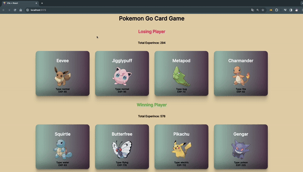

# Pokemon Go Card Game

Bu proje, [Vite](https://vitejs.dev/) ve [React](https://reactjs.org/) kullanılarak geliştirilmiş, basit bir Pokemon kart oyununu içermektedir. Oyun, Pokegame bileşenini içerir ve Pokemon kartlarını ekrana getirir. Proje, Vite'in hızlı geliştirme deneyimi ve React'in bileşen tabanlı yapısını birleştirerek kullanıcı dostu bir oyun ortamı sunmaktadır.

## Kurulum

Projeyi yerel bilgisayarınıza klonlamak için aşağıdaki komutu kullanabilirsiniz:

```bash
git clone https://github.com/avcisalih/PokeGame
```

Proje dizinine gidin:

```bash
cd PROJE_ADI
```

Gerekli bağımlılıkları yüklemek için:

```bash
npm install
```

Proje üzerinde çalışmaya başlamak için:

```bash
npm run dev
```

Tarayıcınızda `http://localhost:3000` adresine giderek uygulamayı görebilirsiniz.

## Responsive Uyum

Bu proje, farklı ekran boyutlarına uyum sağlamak üzere tasarlanmıştır. Kullanıcılar, hem masaüstü hem de mobil cihazlarda oyunu rahatlıkla oynayabilirler.

## Ekran Görüntüsü




